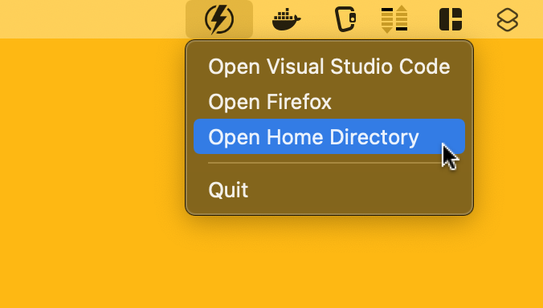

# Menu Barmaid

## Overview
"Menu Barmaid" is a macOS utility template, crafted for software/javascript developers who wish to build and customize their own menu bar tools. 

## Features
- **Quick Access**: Instantly open applications like Visual Studio Code and Firefox.
- **Home Directory**: Navigate easily to your Home Directory.
- **Effortless Integration**: Seamlessly fits into your macOS menu bar.

## Usage
- Click the menu bar icon to display the dropdown menu.
- Select the action you need, like opening an application or accessing the Home Directory.

## Launching on Login
To have "Menu Barmaid" launch on login:
1. Go to System Preferences > Users & Groups.
2. Select your user account.
3. Click 'Login Items'.
4. Click '+' and add "Menu Barmaid" to the list.

## Development
Built using Electron, this project is tailored for macOS. To get started:
- `npm install` to install the dependencies.
- `npm start` to run the app.
- `npm run build` to build the app.